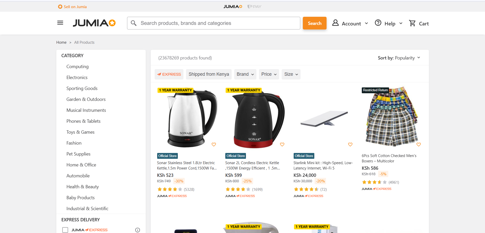
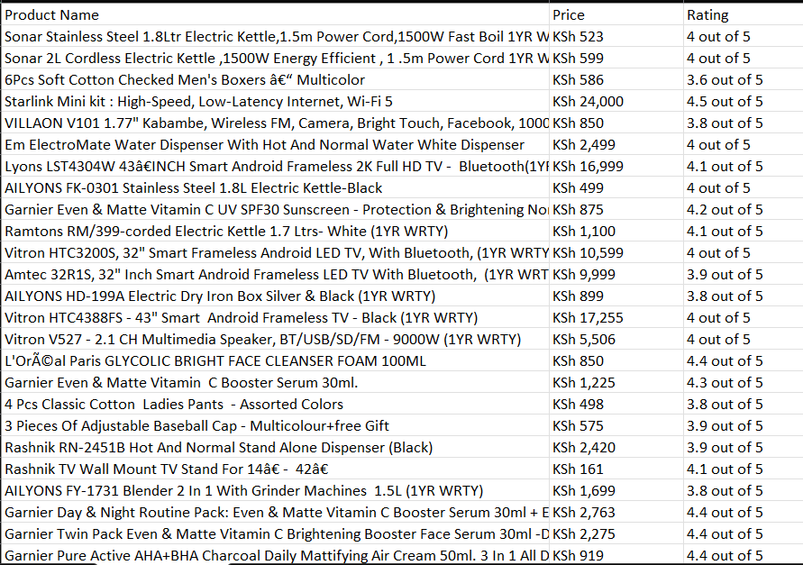

# Web_Scraper

## Overview:
This project is a Python-based web scraper that collects product information from the 'www.jumia.co.ke' website. It visits multiple pages of product listings and extracts details like the product name, price, and user rating. To avoid detection and make the process smoother, it uses techniques that mimic real browsing behavior. The extracted data is then organized and saved into a CSV file for easy access and analysis. It's a handy tool for gathering e-commerce data for research, comparisons, or trend tracking—all done automatically with just a bit of code.

## Features:

-  Page-by-page automation – Collects product data from multiple pages (up to 50) with a single run.
-  Product detail extraction – Gathers product names, current prices, and customer ratings when available.
-  Clean and readable output – Strips unnecessary characters and whitespace to keep the data tidy.
-  CSV export – Saves all the scraped information in a structured file for easy viewing or further analysis.
-  Beginner-friendly logic – Uses simple Python libraries and readable code structure, perfect for learning or modification

## Requirements:
### Software & Libraries:
- Python 3.7 or higher – the main programming language
- Google Chrome – for rendering dynamic content via browser automation
- pip – Python package installer (usually bundled with Python)

### Packages:
- undetected-chromedriver – lets the script act like a real Chrome browser, bypassing anti-bot protection
- beautifulsoup4 – for parsing and extracting data from HTML
- pandas – to store and export the data to CSV

## Project Overview:

### Step 1️: Set Up Your Environment
- Install Python and necessary libraries (like requests, BeautifulSoup, pandas)
- Choose an editor or IDE to write your code (e.g., VS Code, Jupyter)
- Make sure you have a browser installed to inspect web elements

### Step 2️: Explore the Target Website
- Visit the website manually and locate the data you want
- Use browser developer tools to inspect HTML structure
- Identify tags and classes associated with the info (e.g., product titles, prices)

### Step 3️: Write the Scraper Logic
- Send a request to the website and fetch the page content
- Use an HTML parser to extract specific elementss
- Loop through items and collect the necessary data

### Step 4: Handle Data and Save It
- Store the extracted data in lists or a data table
- Clean or format the data as needed
- Export the final results to a CSV or Excel file

### Step 5️: Improve and Scale
- Add error handling for missing data or connection issues
- Pause between requests to avoid getting blocked
- Expand to scrape more fields or multiple pages

## Website:

## Output:

## License:
This project is licensed under MIT License